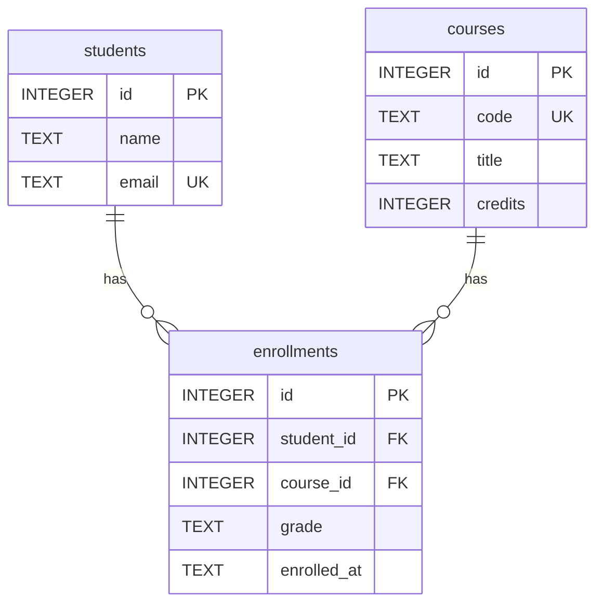

# Student Course Enrollment

Student Course Enrollment is a small Python project that demonstrates a layered architecture with SQLite. It manages students, courses, and enrollments through a CLI application and includes automated tests for the service layer.

## Assignment Requirements

- Choose/design a simple database with 3 tables
- Write a demonstration of layered architecture
- Use Python
- Push to GitHub/GitLab and share the link

Repository link: `<paste-your-repository-link-here>`

## Project Summary

This project uses:

- Python for the application logic
- SQLite for the database
- A layered architecture to separate responsibilities
- Pytest for simple service-layer tests

## Database Design

The database contains 3 tables:

1. `students`
2. `courses`
3. `enrollments`

### Table Details

#### `students`

| Column | Type | Constraints |
| --- | --- | --- |
| `id` | INTEGER | PRIMARY KEY AUTOINCREMENT |
| `name` | TEXT | NOT NULL |
| `email` | TEXT | NOT NULL, UNIQUE |

#### `courses`

| Column | Type | Constraints |
| --- | --- | --- |
| `id` | INTEGER | PRIMARY KEY AUTOINCREMENT |
| `code` | TEXT | NOT NULL, UNIQUE |
| `title` | TEXT | NOT NULL |
| `credits` | INTEGER | NOT NULL |

#### `enrollments`

| Column | Type | Constraints |
| --- | --- | --- |
| `id` | INTEGER | PRIMARY KEY AUTOINCREMENT |
| `student_id` | INTEGER | NOT NULL, FOREIGN KEY |
| `course_id` | INTEGER | NOT NULL, FOREIGN KEY |
| `grade` | TEXT | NULLABLE |
| `enrolled_at` | TEXT | NOT NULL |

### Relationship Notes

- One student can have many enrollments.
- One course can have many enrollments.
- `enrollments` is the linking table for the many-to-many relationship between students and courses.
- `UNIQUE(student_id, course_id)` prevents duplicate enrollment in the same course.

## ERD Mermaid



## Layered Architecture

This project is organized into layers so each part has one responsibility.

### Presentation Layer

- Location: `src/presentation/cli.py`
- Handles user interaction through a command-line menu
- Reads input from the user
- Displays results and error messages

### Service Layer

- Location: `src/services/enrollment_service.py`
- Contains the business logic
- Validates inputs before data is saved
- Checks whether students and courses exist before enrollment
- Coordinates work between the presentation layer and repositories

### Repository Layer

- Location: `src/repositories/`
- Talks directly to SQLite
- Runs SQL queries for students, courses, and enrollments
- Returns Python domain objects to the service layer

### Data Layer

- Location: `src/data/`
- Manages SQLite connections
- Initializes the schema from `schema.sql`
- Keeps database setup logic separate from business logic

### Domain Layer

- Location: `src/domain/entities.py`
- Defines the main entities used in the application:
  - `Student`
  - `Course`
  - `Enrollment`

## Folder Structure

```text
student-course-enrollment/
├── README.md
├── requirements.txt
├── seed.py
├── docs/
│   └── database_design.md
├── src/
│   ├── __init__.py
│   ├── main.py
│   ├── data/
│   │   ├── __init__.py
│   │   ├── database.py
│   │   └── schema.sql
│   ├── domain/
│   │   ├── __init__.py
│   │   └── entities.py
│   ├── presentation/
│   │   ├── __init__.py
│   │   └── cli.py
│   ├── repositories/
│   │   ├── __init__.py
│   │   ├── course_repository.py
│   │   ├── enrollment_repository.py
│   │   └── student_repository.py
│   └── services/
│       ├── __init__.py
│       └── enrollment_service.py
└── tests/
    └── test_enrollment_service.py
```

## Installation

1. Clone the repository.
2. Move into the project directory:

```bash
cd student-course-enrollment
```

3. Install dependencies:

```bash
python3 -m pip install -r requirements.txt
```

If your machine already maps `python` to Python 3, you can replace `python3` with `python`.

## Run Seed Data

This command recreates `enrollment.db` and inserts sample data.

```bash
python3 seed.py
```

## Run the CLI Demo

```bash
python3 -m src.main
```

## Run Tests

The tests use a separate temporary database file named `test_enrollment.db` inside pytest's temporary directory, so the real database is not affected.

```bash
python3 -m pytest
```

## Demo Features

The CLI demonstrates these functions:

- Create a student
- Create a course
- Enroll a student in a course
- Update a student's grade
- List students
- List courses
- List enrollments

## Example Demo Flow

1. Run `python3 seed.py`
2. Run `python3 -m src.main`
3. Choose menu options to:
   - add a new student
   - add a new course
   - enroll the student in a course
   - update the enrollment grade
   - list existing records

## Verification Commands

Use these commands before submitting:

```bash
python3 seed.py
python3 -m src.main
python3 -m pytest
```

## Submission

- GitHub/GitLab link: `<paste-your-final-link-here>`
