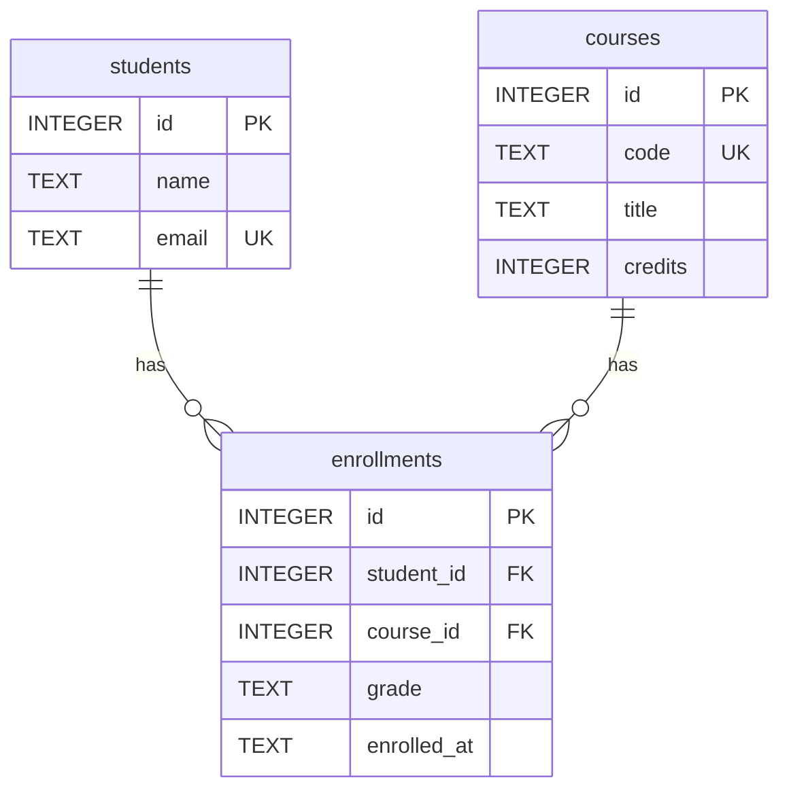

# Database Design

## Topic

This project is a simple student course enrollment system. It stores students,
courses, and the enrollments that connect students to the courses they take.

## Tables

### students

Stores student information.

| Column | Type | Constraint |
| --- | --- | --- |
| id | INTEGER | PRIMARY KEY AUTOINCREMENT |
| name | TEXT | NOT NULL |
| email | TEXT | NOT NULL UNIQUE |

### courses

Stores course information.

| Column | Type | Constraint |
| --- | --- | --- |
| id | INTEGER | PRIMARY KEY AUTOINCREMENT |
| code | TEXT | NOT NULL UNIQUE |
| title | TEXT | NOT NULL |
| credits | INTEGER | NOT NULL |

### enrollments

Stores the registration record between one student and one course.

| Column | Type | Constraint |
| --- | --- | --- |
| id | INTEGER | PRIMARY KEY AUTOINCREMENT |
| student_id | INTEGER | NOT NULL, FOREIGN KEY |
| course_id | INTEGER | NOT NULL, FOREIGN KEY |
| grade | TEXT | Optional |
| enrolled_at | TEXT | NOT NULL |

## Relationships

- One student can have many enrollment records.
- One course can have many enrollment records.
- The `enrollments` table connects `students` and `courses`, so a student can
  take many courses and a course can have many students.
- `UNIQUE(student_id, course_id)` prevents the same student from enrolling in
  the same course more than once.

## ERD

## Why enrollments is a linking table

Students and courses have a many-to-many relationship: one student can enroll
in many courses, and one course can contain many students. A relational database
represents this relationship with a linking table. In this project,
`enrollments` stores each student-course pair and also keeps information about
that registration, such as `grade` and `enrolled_at`.
